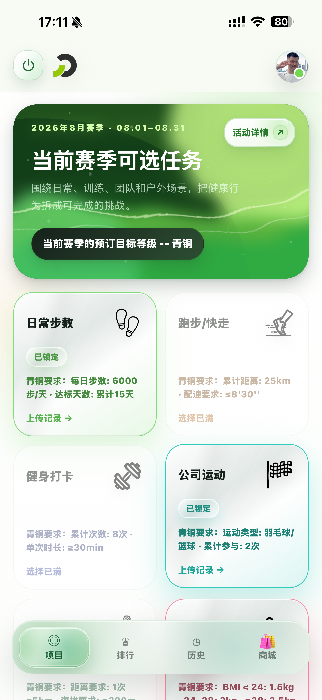
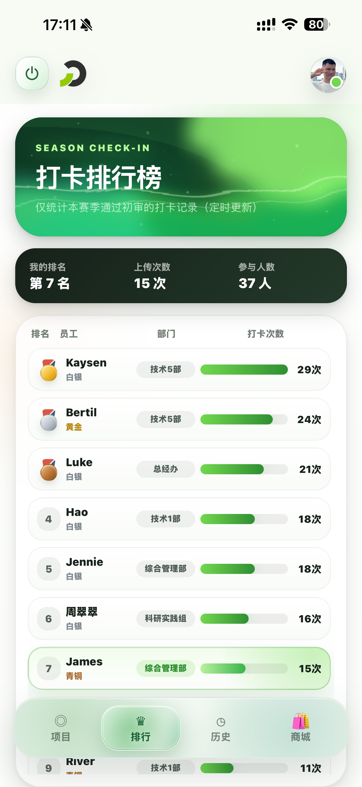
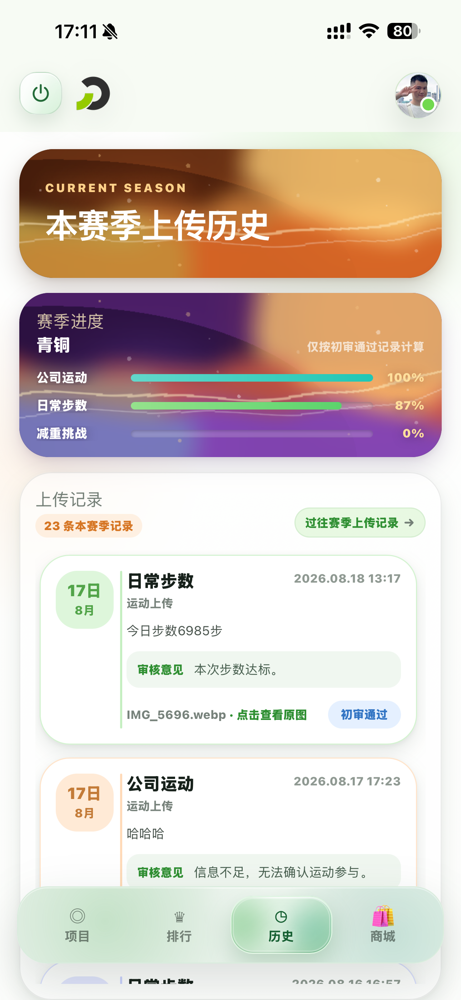
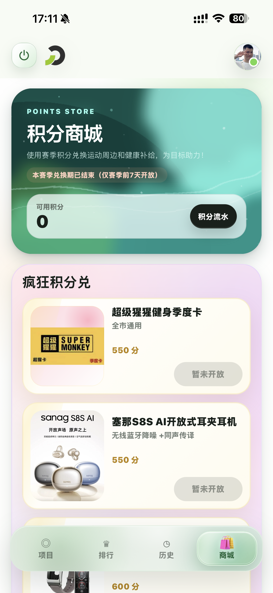

# Flame Sport Pheno 客户端前端

> **项目定位**
>
> Flame Sport Pheno 是面向企业员工健康挑战的移动端 Web 应用。客户端以赛季为业务周期，完整承载项目报名、运动凭证上传、审核记录、打卡排行、积分获取和商品兑换，主要运行于钉钉 H5 工作台。

## 1. 项目概览

当前客户端已经完成核心业务闭环并接入真实后端接口。用户进入应用后，可以依次完成以下流程：

1. 通过钉钉免登或开发模式登录。
2. 查看当前赛季、活动规则和全部运动项目。
3. 锁定赛季要求数量的项目，并统一选择挑战等级。
4. 按项目要求选择图片、查看拼接结果并上传运动凭证。
5. 查看当前赛季进度、审核历史、可补传记录和打卡排行榜。
6. 获取积分、查看积分流水，并在开放期内兑换商品。

没有激活赛季时，项目规则、过往审核、商品和积分流水仍可浏览，赛季报名、锁定、上传、兑换和当前赛季排行会进入只读状态。赛季开始后的配置保护期同样会暂时关闭赛季写入入口，并提示距离正式开放的剩余时间；意见提交不受该保护期影响。

---

## 2. 功能范围

- **登录与用户资料**：支持钉钉 H5 免登、开发授权码登录、登录失效自动恢复和头像读取。
- **赛季与活动规则**：读取当前赛季、参与状态和服务端时间轴，并通过鉴权接口获取管理端可覆盖的活动规则海报。
- **项目报名**：展示项目规则和挑战要求，按赛季配置锁定项目数量，并为本赛季统一锁定青铜、白银或黄金等级。
- **运动凭证上传**：支持选择 1 ～ 5 张图片、WebP 压缩、多图纵向拼接、完整结果预览、备注填写和二次确认提交。
- **历史与补传**：展示当前及过往赛季记录、审核状态、审核意见和受保护原图，并为具备资格的记录提供补传流程。
- **打卡排行榜**：展示当前赛季通过初审的打卡次数、参与人数、个人排名和全员排行，并高亮当前用户。
- **积分商城**：展示商品、可用积分和积分流水，在赛季兑换窗口内通过二次确认完成兑换。
- **全局交互**：提供意见提交、钉钉应用退出、屏幕边缘退出手势、路由滑动过渡和移动端安全区适配。

---

## 3. 页面预览

以下预览图对应当前四个底部导航主页面，图片统一维护在 `description/preview-image/`。

| 项目 | 排行榜 | 历史 | 商城 |
| :--: | :----: | :--: | :--: |
|  |  |  |  |

---

## 4. 交互与视觉

- 项目、排行榜、历史、商城和可补传入口使用按需加载的 PixiJS 液体背景，通过不同配色、波形和流速保持统一主题与页面辨识度。
- 四个主页面按照底部导航位置进行左右滑动切换，悬浮玻璃导航框会连续移动到当前页面。
- 顶部导航、全局弹层和页面滚动区统一适配设备安全区，底部导航悬浮在内容上方，页面末尾保留独立避让空间。
- 项目卡片会区分轻点与滚动，上传弹层使用全局模态层，减少移动端 WebView 中的误触和内容遮挡。
- WebGL 不可用、上下文丢失或系统开启“减少动态效果”时，页面自动使用静态渐变并收敛位移动画。

---

## 5. 技术实现

项目沿用轻量的 Vue 3 前端架构，不引入独立状态管理库或通用 UI 组件库。

| 技术 | 当前用途 |
| ---- | -------- |
| Vue 3 Options API | 页面与组件实现 |
| Vue Router 4 | Hash 路由、页面顺序和缓存编排 |
| Axios | 鉴权请求、错误恢复和接口访问 |
| PixiJS 8 | 顶部卡片液体流动视觉 |
| `@jsquash/webp` | Canvas 无法编码 WebP 时的按需兼容方案 |
| Scoped CSS | 移动端布局、主题、过渡和降级样式 |

页面 View 负责加载与编排业务数据，`src/api/` 统一处理请求协议和字段归一化，组件通过 props 与事件完成呈现和交互，跨页面数据由 `src/state/` 中的轻量响应式状态维护。

```text
src/
  api/          # 鉴权、请求封装、业务接口和字段归一化
  assets/       # 启动封面、图标和其他前端静态资源
  components/   # 页面组件、交互面板和全局视觉组件
  router/       # Hash 路由、页面顺序和缓存配置
  state/        # 登录、赛季、项目和跨页面共享状态
  utils/        # 图片处理、时间窗口和业务辅助逻辑
  views/        # 路由页面与业务流程编排
description/    # 项目概况、业务文档、接口约定和页面预览
```

---

## 6. 本地开发

建议使用 Node.js 20，与 Docker 构建环境保持一致。首次启动时，在仓库根目录执行：

```bash
npm ci
cp .env.example .env.local
npm run serve
```

开发服务监听 `127.0.0.1:8080`，资源路径为 `/dev/flame/`。本机可访问 `http://127.0.0.1:8080/dev/flame/`；通过其他域名反向代理时，需要同步将域名加入 `vue.config.js` 的 `devServer.allowedHosts`。

### 6.1 环境变量

`.env.example` 提供可共享的开发配置模板，实际授权码和生产配置不得提交到仓库。

| 变量 | 用途 |
| ---- | ---- |
| `VUE_APP_API_BASE_URL` | API 基础地址，默认使用 `/flame/api`；开发模式会自动插入 `/dev` 前缀 |
| `VUE_APP_MODE` | `development` 使用开发授权码，`production` 使用钉钉免登 |
| `VUE_APP_AUTH_CODE` | 开发模式提交给登录接口的授权码，仅用于本地或受控联调环境 |
| `VUE_APP_ACTIVE_SEASON_CONFIG_EDIT_WINDOW_HOURS` | 赛季开始后的配置保护期小时数，必须与后端配置保持一致 |
| `VUE_APP_SHOP_REDEEM_WINDOW_DAYS` | 从赛季开始日起允许兑换的自然日数，默认值为 `7` |
| `VUE_APP_PAGE_TITLE` | 浏览器页签和钉钉 WebView 显示的应用名称 |
| `VUE_APP_DINGTALK_CORP_ID` | 钉钉企业 CorpId，生产免登使用 |
| `VUE_APP_DINGTALK_CLIENT_ID` | 钉钉 H5 应用 ClientId，生产免登使用 |
| `VUE_APP_DINGTALK_JSAPI_URL` | 钉钉 JSAPI 地址；未配置时使用项目内置的官方默认地址 |

> **注意**
>
> Vue CLI 在启动或构建时读取环境变量。修改配置后必须重启开发服务或重新构建镜像。前端的时间窗口提示只负责交互反馈，后端校验始终是写入权限的最终依据。

### 6.2 常用命令

```bash
npm run serve
npm run lint
npm run build
```

---

## 7. 构建与部署

生产构建固定部署在 `/flame/` 子路径。直接构建静态产物时执行：

```bash
npm ci
npm run lint
npm run build
```

项目提供基于 Node.js 20 和 Nginx 的两阶段 `Dockerfile`。独立构建镜像时，可以在编译阶段注入公开的前端配置：

```bash
docker build \
  --build-arg VUE_APP_API_BASE_URL=/flame/api \
  --build-arg VUE_APP_SHOP_REDEEM_WINDOW_DAYS=7 \
  --build-arg VUE_APP_ACTIVE_SEASON_CONFIG_EDIT_WINDOW_HOURS=24 \
  --build-arg VUE_APP_PAGE_TITLE=<应用名称> \
  --build-arg VUE_APP_DINGTALK_CORP_ID=<钉钉企业 CorpId> \
  --build-arg VUE_APP_DINGTALK_CLIENT_ID=<钉钉 H5 应用 ClientId> \
  -t flame-sport-pheno-fe .

docker run --rm --name flame-sport-pheno-fe -p 8080:80 flame-sport-pheno-fe
```

容器入口为 `http://127.0.0.1:8080/flame/`。容器内 Nginx 只提供前端静态资源，生产网关必须将同域 `/flame/api/` 转发到客户端后端。

完整部署仓库的 `docker-compose.yml` 会把共享的 `ACTIVE_SEASON_CONFIG_EDIT_WINDOW_HOURS` 同时注入客户端后端、管理端后端和前端构建，避免保护期口径不一致。带内容哈希的静态资源使用长期不可变缓存，入口 HTML 和其他非哈希资源使用 `no-store`；若钉钉 WebView 仍加载到过期入口而主脚本无法读取，页面会自动刷新一次并提供手动重试提示。

---

## 8. 文档入口

根 README 只维护项目对外介绍、页面预览和运行方式。业务规则、接口契约与维护边界按以下顺序阅读：

1. [项目概况](./description/project.md)：业务闭环、实现状态、关键规则和前端编排。
2. [文档地图](./description/README.md)：各业务域文档入口和推荐阅读顺序。
3. [项目文档撰写规范](./description/document-style.md)：Markdown 结构、格式、表达和维护规则。
4. [通用接口约定](./description/conventions/api-response.md)：API 基础地址、鉴权、字段归一化和错误处理。

开始修改功能前，应继续阅读文档地图中与当前 View、Component、API 和 State 直接相关的业务文档。
