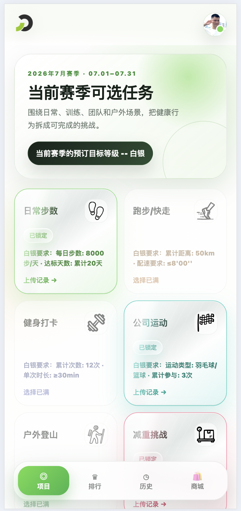
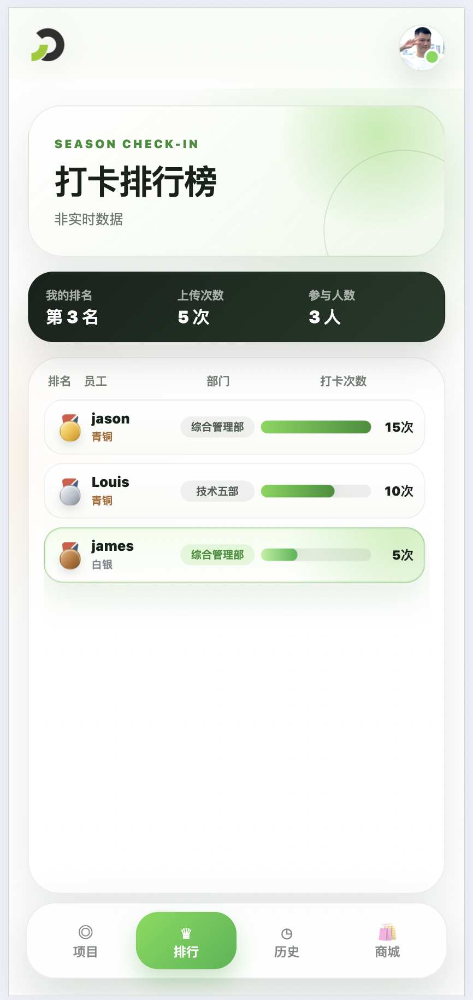
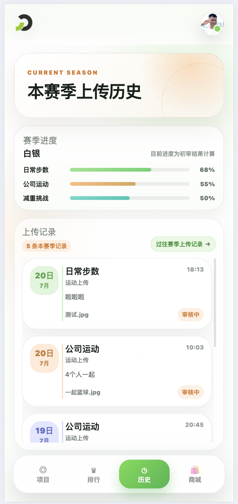
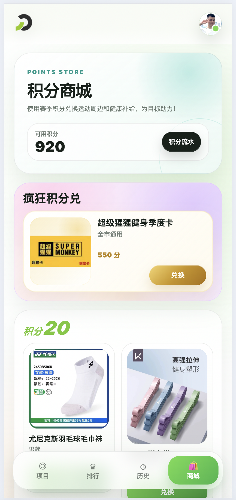

# Flame Sport Pheno

Flame Sport Pheno 是一个面向企业健康挑战场景的移动端 Web 应用。员工可以在赛季内选择运动项目、锁定挑战等级、上传运动凭证、查看排行榜与审核记录，并使用获得的积分兑换奖品。

项目主要运行于钉钉 H5 环境，同时保留普通浏览器下的本地开发登录方式。当前核心业务流程已接入真实接口；没有激活赛季时，应用仍可浏览项目规则、过往审核、商品与积分流水，并以“敬请期待”阻断赛季相关操作。

## 核心功能

- **赛季与项目挑战**：获取当前赛季及可选运动项目，按赛季要求锁定项目并统一选择青铜、白银或黄金挑战等级。
- **运动凭证上传**：根据项目配置选择记录类型，完成图片预览、压缩和备注后提交运动凭证。
- **赛季排行榜**：按照当前赛季有效打卡次数展示所有用户的排名，并高亮当前用户。
- **上传与审核历史**：查看当前赛季和过往赛季的凭证记录、审核状态与审核意见。
- **积分商城**：按积分档位浏览奖品，查看积分流水，并通过二次确认完成商品兑换。

应用启动时还会完成钉钉免登、会话失效自动重登，以及必要的健康基础信息采集。

## 页面预览

<table>
  <tr>
    <th>项目</th>
    <th>排行</th>
    <th>历史</th>
    <th>商城</th>
  </tr>
  <tr>
    <td></td>
    <td></td>
    <td></td>
    <td></td>
  </tr>
</table>

## 技术栈

- Vue 3 与 Vue Router 4
- Vue CLI 5
- JavaScript
- Axios
- Scoped CSS、CSS 动画与响应式布局

项目未引入额外 UI 组件库。路由页面负责业务数据编排，组件负责页面呈现与交互，接口响应在 `src/api/` 中统一转换为前端数据模型，跨页面状态由 `src/state/` 中的轻量响应式状态维护。

## 目录结构

```text
src/
  api/          # 登录鉴权、请求封装和各业务域接口
  components/   # 页面组件与交互面板
  router/       # 路由与页面缓存配置
  state/        # 跨页面共享状态
  utils/        # 业务辅助函数
  views/        # 路由页面与数据编排
concept/        # 初始产品线框与挑战规则参考
description/    # 接口、页面流程和数据库设计文档
  preview-image/ # README 页面预览图
```

详细的项目逻辑、接口接入范围、Agent 阅读路径和维护约定请参阅 [description/project.md](./description/project.md)。

## 本地开发

```bash
# 安装依赖
npm install

# 启动开发服务
npm run serve

# 生产构建
npm run build

# 代码检查
npm run lint
```

开发环境通过 `.env` 配置带 `/flame/api` 前缀的后端基础地址、登录模式及钉钉 H5 参数。浏览器直接请求后端，因此后端需要允许本地开发地址的跨域请求。启动后根据终端输出访问本地地址，默认通常为 `http://localhost:8080`。

推荐将浏览器联调配置放入 `.env.development`。通过 `VUE_APP_MODE` 指定登录模式：`development` 会直接使用 `VUE_APP_AUTH_CODE` 调用后端登录接口，不会向钉钉请求免登码；`production` 会走钉钉免登。修改环境变量后需要重启开发服务。

```env
VUE_APP_MODE=development
VUE_APP_AUTH_CODE=<后端提供的开发 auth_code>
```

开发与生产环境均部署在 `/flame/` 子路径下，favicon、JavaScript、CSS 及其他静态资源会自动使用 `/flame/` 前缀；未显式配置 `VUE_APP_API_BASE_URL` 时，业务接口请求为 `/flame/api/<endpoint>`。部署后入口地址为 `https://<host>/flame/`；本地开发入口为 `http://localhost:8080/flame/`。

商城默认仅在赛季开始日起的前 7 个自然日开放兑换。可通过 `.env` 或生产构建环境变量调整，修改后需要重新启动开发服务或重新构建：

```env
VUE_APP_SHOP_REDEEM_WINDOW_DAYS=7
```

页面标题可在 `.env.development`（本地开发）或对应的构建环境中配置；不配置时为“燃动现象”。

```env
VUE_APP_PAGE_TITLE=燃动现象
```

## Docker 部署

项目提供前端专用的两阶段 `Dockerfile`：Node 负责构建，Nginx 只负责提供静态资源。镜像默认将接口基地址编译为同域的 `/flame/api`。Vue CLI 在构建期读取 `VUE_APP_*`，因此需要在构建镜像时传入钉钉 Corp ID 与 Client ID。

```bash
docker build \
  --build-arg VUE_APP_SHOP_REDEEM_WINDOW_DAYS=7 \
  --build-arg VUE_APP_PAGE_TITLE=燃动现象 \
  --build-arg VUE_APP_DINGTALK_CORP_ID=<钉钉企业 CorpId> \
  --build-arg VUE_APP_DINGTALK_CLIENT_ID=<钉钉 H5 应用 ClientId> \
  -t flame-sport-pheno-fe .
docker run --rm --name flame-sport-pheno-fe -p 8080:80 flame-sport-pheno-fe
```

容器访问入口为 `http://localhost:8080/flame/`。若接口不与前端同域，可在构建时覆盖 API 基地址：

```bash
docker build \
  --build-arg VUE_APP_API_BASE_URL=https://api.example.com/flame/api \
  --build-arg VUE_APP_SHOP_REDEEM_WINDOW_DAYS=7 \
  --build-arg VUE_APP_PAGE_TITLE=燃动现象 \
  --build-arg VUE_APP_DINGTALK_CORP_ID=<钉钉企业 CorpId> \
  --build-arg VUE_APP_DINGTALK_CLIENT_ID=<钉钉 H5 应用 ClientId> \
  -t flame-sport-pheno-fe .
```

钉钉 JSAPI 地址使用代码内置的官方默认值，不需要传入构建参数；如需升级版本或切换 CDN，再额外配置 `VUE_APP_DINGTALK_JSAPI_URL`。

该容器处理 `/flame/` 的前端静态资源，并将 `/flame/api/` 代理到 Docker Compose 中的 `backend:8000`。完整的前后端与 MySQL 统一部署方式见上级目录的 `docker-compose.yml`。单独部署前端镜像时，需为 Nginx 提供名为 `backend` 的可解析上游服务。

## 浏览器支持

目标运行环境为现代移动端浏览器及钉钉 H5 WebView。项目会在不支持 CSS `color-mix()` 的旧版 Android WebView 中自动降级为实色卡片并关闭背景模糊，避免未知颜色函数导致整块背景声明失效、内容透出；支持这些能力的设备保持原有玻璃质感和动画。
